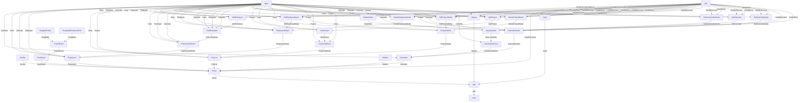

```mermaid
graph TD;
    Login -- Login --> App
    Signup -- Signup --> App
    Home -- Home --> App
    App -- App --> main
    ViewCalender -- View_Calendar --> CalendarAddView
    types -- Calendar --> CalendarAddView
    utils -- handleError --> CalendarDetails
    utils -- handleSuccess --> CalendarDetails
    EditCalendarModal -- EditCalendarModal --> CalendarDetails
    DeleteCalendarModal -- DeleteCalendarModal --> CalendarDetails
    types -- Calendar --> CalendarDetails
    types -- Holiday --> CalendarDetails
    HolidayTable -- DataTable --> CalendarDetails
    types -- Calendar --> ViewCalender
    AddCalendar -- AddCalendar --> ViewCalender
    types -- Holiday --> HolidayTable
    types -- Calendar --> EditCalendarModal
    utils -- handleError --> EditCalendarModal
    utils -- handleSuccess --> EditCalendarModal
    utils -- handleError --> AddCalendar
    utils -- handleSuccess --> AddCalendar
    types -- Calendar --> AddCalendar
    types -- Calendar --> DeleteCalendarModal
    utils -- handleError --> DeleteCalendarModal
    utils -- handleSuccess --> DeleteCalendarModal
    ViewProject -- ViewProject --> ProjectAddView
    types -- IUser --> ProjectAddView
    types -- Project --> ProjectAddView
    EditProjectModal -- EditProjectModal --> ProjectDetails
    DeleteProjectModal -- DeleteProjectModal --> ProjectDetails
    types -- Project --> ProjectDetails
    types -- IUser --> ProjectDetails
    DraggableTask -- Draggable --> ProjectBoard
    DroppableEmployeeRow -- Droppable --> ProjectBoard
    types -- Project --> AddProject
    types -- IUser --> AddProject
    utils -- handleError --> AddProject
    utils -- handleSuccess --> AddProject
    types -- IUser --> ViewProject
    types -- Project --> ViewProject
    AddProject -- AddProject --> ViewProject
    utils -- handleError --> EditProjectModal
    utils -- handleSuccess --> EditProjectModal
    types -- Project --> EditProjectModal
    types -- IUser --> EditProjectModal
    utils -- handleError --> DeleteProjectModal
    utils -- handleSuccess --> DeleteProjectModal
    types -- Project --> DeleteProjectModal
    types -- Calendar --> ViewEmployee
    types -- Employee --> ViewEmployee
    types -- IUser --> ViewEmployee
    AddEmployee -- AddEmployee --> ViewEmployee
    EditEmployeeModal -- EditEmployeeModal --> EmployeeDetails
    DeleteEmployeeModal -- DeleteEmployeeModal --> EmployeeDetails
    types -- Calendar --> EmployeeDetails
    types -- Employee --> EmployeeDetails
    types -- IUser --> EmployeeDetails
    ViewEmployee -- View_Employee --> EmployeeAddView
    types -- Calendar --> EmployeeAddView
    types -- Employee --> EmployeeAddView
    types -- IUser --> EmployeeAddView
    utils -- handleError --> DeleteEmployeeModal
    utils -- handleSuccess --> DeleteEmployeeModal
    types -- Employee --> DeleteEmployeeModal
    utils -- handleError --> EditEmployeeModal
    utils -- handleSuccess --> EditEmployeeModal
    types -- Employee --> EditEmployeeModal
    types -- IUser --> EditEmployeeModal
    types -- Calendar --> AddEmployee
    types -- Employee --> AddEmployee
    types -- IUser --> AddEmployee
    utils -- handleError --> AddEmployee
    utils -- handleSuccess --> AddEmployee
    utils -- handleError --> Login
    utils -- handleSuccess --> Login
    utils -- handleSuccess --> Home
    Navbar -- Navbar --> Home
    Employees -- Employees --> Home
    Projects -- Projects --> Home
    Calendars -- Calendar --> Home
    Sidebar -- Sidebar --> Home
    Dashboard -- Dashboard --> Home
    utils -- handleError --> Signup
    utils -- handleSuccess --> Signup
    ProjectAddView -- ProjectAddView --> Projects
    ProjectDetails -- ProjectDetails --> Projects
    types -- Project --> Projects
    types -- IUser --> Projects
    ProjectBoard -- ProjectBoard --> Dashboard
    EmployeeAddView -- EmployeeAddView --> Employees
    EmployeeDetails -- EmployeeDetails --> Employees
    types -- Employee --> Employees
    types -- Calendar --> Employees
    types -- IUser --> Employees
    CalendarAddView -- CalendarAddView --> Calendars
    CalendarDetails -- CalendarDetails --> Calendars
    types -- Calendar --> Calendars
```
