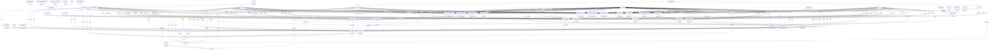

```mermaid
graph TD;
    js -- js --> eslint.config
    globals -- globals --> eslint.config
    eslint-plugin-react-hooks -- reactHooks --> eslint.config
    eslint-plugin-react-refresh -- reactRefresh --> eslint.config
    typescript-eslint -- tseslint --> eslint.config
    vite -- defineConfig --> vite.config
    plugin-react-swc -- react --> vite.config
    react-router-dom -- Navigate --> App
    react-router-dom -- Route --> App
    react-router-dom -- Routes --> App
    Login -- Login --> App
    Signup -- Signup --> App
    Home -- Home --> App
    react-toastify -- ToastContainer --> App
    react -- StrictMode --> main
    client -- createRoot --> main
    App -- App --> main
    react-router-dom -- BrowserRouter --> main
    react-toastify -- toast --> utils
    react --> Navbar
    material -- AppBar --> Navbar
    material -- Typography --> Navbar
    material -- IconButton --> Navbar
    AccountCircle -- AccountCircleIcon --> Navbar
    react-router-dom -- useLocation --> RefreshHandler
    react-router-dom -- useNavigate --> RefreshHandler
    material -- Stack --> Sidebar
    material -- Button --> Sidebar
    react-router-dom -- NavLink --> Sidebar
    Dashboard -- DashboardIcon --> Sidebar
    Assignment -- AssignmentIcon --> Sidebar
    Hail -- HailIcon --> Sidebar
    CalendarMonth -- CalendarMonthIcon --> Sidebar
    react --> CalendarAddView
    ViewCalender -- View_Calendar --> CalendarAddView
    material -- Container --> CalendarAddView
    material -- Box --> CalendarAddView
    types -- Calendar --> CalendarAddView
    react-router-dom -- useParams --> CalendarDetails
    react -- useState --> CalendarDetails
    react -- useEffect --> CalendarDetails
    utils -- handleError --> CalendarDetails
    utils -- handleSuccess --> CalendarDetails
    DeleteSharp -- DeleteSharpIcon --> CalendarDetails
    EditSharp -- EditSharpIcon --> CalendarDetails
    EditCalendarModal -- EditCalendarModal --> CalendarDetails
    DeleteCalendarModal -- DeleteCalendarModal --> CalendarDetails
    types -- Calendar --> CalendarDetails
    types -- Holiday --> CalendarDetails
    HolidayTable -- DataTable --> CalendarDetails
    material -- Button --> ViewCalender
    material -- Chip --> ViewCalender
    material -- TextField --> ViewCalender
    react-router-dom -- useNavigate --> ViewCalender
    types -- Calendar --> ViewCalender
    react -- useState --> ViewCalender
    AddCalendar -- AddCalendar --> ViewCalender
    material -- Modal --> ViewCalender
    material -- Box --> ViewCalender
    x-data-grid -- DataGrid --> HolidayTable
    x-data-grid -- GridColDef --> HolidayTable
    Paper -- Paper --> HolidayTable
    IconButton -- IconButton --> HolidayTable
    Delete -- DeleteIcon --> HolidayTable
    types -- Holiday --> HolidayTable
    react -- useState --> EditCalendarModal
    react -- useEffect --> EditCalendarModal
    material -- Modal --> EditCalendarModal
    material -- Box --> EditCalendarModal
    material -- Typography --> EditCalendarModal
    material -- Button --> EditCalendarModal
    material -- TextField --> EditCalendarModal
    types -- Calendar --> EditCalendarModal
    utils -- handleError --> EditCalendarModal
    utils -- handleSuccess --> EditCalendarModal
    react -- useState --> AddCalendar
    material -- TextField --> AddCalendar
    material -- Button --> AddCalendar
    material -- Typography --> AddCalendar
    material -- Box --> AddCalendar
    utils -- handleError --> AddCalendar
    utils -- handleSuccess --> AddCalendar
    types -- Calendar --> AddCalendar
    react -- useState --> DeleteCalendarModal
    material -- Modal --> DeleteCalendarModal
    material -- Box --> DeleteCalendarModal
    material -- Typography --> DeleteCalendarModal
    material -- Button --> DeleteCalendarModal
    material -- TextField --> DeleteCalendarModal
    types -- Calendar --> DeleteCalendarModal
    utils -- handleError --> DeleteCalendarModal
    utils -- handleSuccess --> DeleteCalendarModal
    react-router-dom -- useNavigate --> DeleteCalendarModal
    ViewProject -- ViewProject --> ProjectAddView
    material -- Container --> ProjectAddView
    material -- Box --> ProjectAddView
    types -- IUser --> ProjectAddView
    types -- Project --> ProjectAddView
    react-router-dom -- useParams --> ProjectDetails
    react -- useState --> ProjectDetails
    react -- useEffect --> ProjectDetails
    DeleteSharp -- DeleteSharpIcon --> ProjectDetails
    EditSharp -- EditSharpIcon --> ProjectDetails
    EditProjectModal -- EditProjectModal --> ProjectDetails
    DeleteProjectModal -- DeleteProjectModal --> ProjectDetails
    types -- Project --> ProjectDetails
    types -- IUser --> ProjectDetails
    material -- Card --> ProjectBoard
    material -- Stack --> ProjectBoard
    material -- Typography --> ProjectBoard
    material -- IconButton --> ProjectBoard
    core -- DndContext --> ProjectBoard
    core -- DragEndEvent --> ProjectBoard
    DraggableTask -- Draggable --> ProjectBoard
    DroppableEmployeeRow -- Droppable --> ProjectBoard
    icons-material -- ChevronLeft --> ProjectBoard
    icons-material -- ChevronRight --> ProjectBoard
    react -- useState --> AddProject
    material -- TextField --> AddProject
    material -- Button --> AddProject
    material -- Typography --> AddProject
    material -- Box --> AddProject
    material -- Autocomplete --> AddProject
    material -- Chip --> AddProject
    types -- Project --> AddProject
    types -- IUser --> AddProject
    utils -- handleError --> AddProject
    utils -- handleSuccess --> AddProject
    react --> LondDiv
    react -- useState --> ViewProject
    material -- Button --> ViewProject
    material -- Chip --> ViewProject
    material -- TextField --> ViewProject
    material -- Modal --> ViewProject
    material -- Box --> ViewProject
    react-router-dom -- useNavigate --> ViewProject
    types -- IUser --> ViewProject
    types -- Project --> ViewProject
    AddProject -- AddProject --> ViewProject
    react -- useState --> EditProjectModal
    react -- useEffect --> EditProjectModal
    material -- Modal --> EditProjectModal
    material -- Box --> EditProjectModal
    material -- Typography --> EditProjectModal
    material -- Button --> EditProjectModal
    material -- TextField --> EditProjectModal
    material -- Autocomplete --> EditProjectModal
    utils -- handleError --> EditProjectModal
    utils -- handleSuccess --> EditProjectModal
    types -- Project --> EditProjectModal
    types -- IUser --> EditProjectModal
    react -- useState --> DeleteProjectModal
    material -- Modal --> DeleteProjectModal
    material -- Box --> DeleteProjectModal
    material -- Typography --> DeleteProjectModal
    material -- Button --> DeleteProjectModal
    material -- TextField --> DeleteProjectModal
    utils -- handleError --> DeleteProjectModal
    utils -- handleSuccess --> DeleteProjectModal
    react-router-dom -- useNavigate --> DeleteProjectModal
    types -- Project --> DeleteProjectModal
    react --> DraggableTask
    core -- useDraggable --> DraggableTask
    react --> DroppableEmployeeRow
    core -- useDroppable --> DroppableEmployeeRow
    material -- Button --> EmployeeCard
    react-router-dom -- useNavigate --> EmployeeCard
    material -- Button --> ViewEmployee
    material -- Chip --> ViewEmployee
    material -- TextField --> ViewEmployee
    material -- Modal --> ViewEmployee
    material -- Box --> ViewEmployee
    react-router-dom -- useNavigate --> ViewEmployee
    react -- useState --> ViewEmployee
    types -- Calendar --> ViewEmployee
    types -- Employee --> ViewEmployee
    types -- IUser --> ViewEmployee
    AddEmployee -- AddEmployee --> ViewEmployee
    react-router-dom -- useParams --> EmployeeDetails
    react -- useState --> EmployeeDetails
    react -- useEffect --> EmployeeDetails
    DeleteSharp -- DeleteSharpIcon --> EmployeeDetails
    EditSharp -- EditSharpIcon --> EmployeeDetails
    EditEmployeeModal -- EditEmployeeModal --> EmployeeDetails
    DeleteEmployeeModal -- DeleteEmployeeModal --> EmployeeDetails
    types -- Calendar --> EmployeeDetails
    types -- Employee --> EmployeeDetails
    types -- IUser --> EmployeeDetails
    ViewEmployee -- View_Employee --> EmployeeAddView
    material -- Container --> EmployeeAddView
    material -- Box --> EmployeeAddView
    types -- Calendar --> EmployeeAddView
    types -- Employee --> EmployeeAddView
    types -- IUser --> EmployeeAddView
    react -- useState --> DeleteEmployeeModal
    material -- Modal --> DeleteEmployeeModal
    material -- Box --> DeleteEmployeeModal
    material -- Typography --> DeleteEmployeeModal
    material -- Button --> DeleteEmployeeModal
    material -- TextField --> DeleteEmployeeModal
    utils -- handleError --> DeleteEmployeeModal
    utils -- handleSuccess --> DeleteEmployeeModal
    react-router-dom -- useNavigate --> DeleteEmployeeModal
    types -- Employee --> DeleteEmployeeModal
    react -- useState --> EditEmployeeModal
    react -- useEffect --> EditEmployeeModal
    material -- Modal --> EditEmployeeModal
    material -- Box --> EditEmployeeModal
    material -- Typography --> EditEmployeeModal
    material -- Button --> EditEmployeeModal
    material -- TextField --> EditEmployeeModal
    material -- Autocomplete --> EditEmployeeModal
    utils -- handleError --> EditEmployeeModal
    utils -- handleSuccess --> EditEmployeeModal
    types -- Employee --> EditEmployeeModal
    types -- IUser --> EditEmployeeModal
    react -- useState --> AddEmployee
    material -- TextField --> AddEmployee
    material -- Button --> AddEmployee
    material -- Typography --> AddEmployee
    material -- Box --> AddEmployee
    material -- FormControlLabel --> AddEmployee
    material -- Checkbox --> AddEmployee
    material -- Autocomplete --> AddEmployee
    material -- Chip --> AddEmployee
    types -- Calendar --> AddEmployee
    types -- Employee --> AddEmployee
    types -- IUser --> AddEmployee
    utils -- handleError --> AddEmployee
    utils -- handleSuccess --> AddEmployee
    react-router-dom -- Link --> Login
    react-router-dom -- useNavigate --> Login
    utils -- handleError --> Login
    utils -- handleSuccess --> Login
    react-router-dom -- Routes --> Home
    react-router-dom -- Route --> Home
    react-router-dom -- useNavigate --> Home
    utils -- handleSuccess --> Home
    Navbar -- Navbar --> Home
    Employees -- Employees --> Home
    Projects -- Projects --> Home
    Calendars -- Calendar --> Home
    Sidebar -- Sidebar --> Home
    Dashboard -- Dashboard --> Home
    react-router-dom -- Link --> Signup
    react-router-dom -- useNavigate --> Signup
    utils -- handleError --> Signup
    utils -- handleSuccess --> Signup
    react -- useState --> Projects
    react -- useEffect --> Projects
    react-router-dom -- Route --> Projects
    react-router-dom -- Routes --> Projects
    ProjectAddView -- ProjectAddView --> Projects
    ProjectDetails -- ProjectDetails --> Projects
    types -- Project --> Projects
    types -- IUser --> Projects
    react --> Dashboard
    ProjectBoard -- ProjectBoard --> Dashboard
    material -- Box --> Dashboard
    react -- useState --> Employees
    react -- useEffect --> Employees
    react-router-dom -- Routes --> Employees
    react-router-dom -- Route --> Employees
    EmployeeAddView -- EmployeeAddView --> Employees
    EmployeeDetails -- EmployeeDetails --> Employees
    types -- Employee --> Employees
    types -- Calendar --> Employees
    types -- IUser --> Employees
    CalendarAddView -- CalendarAddView --> Calendars
    CalendarDetails -- CalendarDetails --> Calendars
    react-router-dom -- Route --> Calendars
    react-router-dom -- Routes --> Calendars
    react -- useState --> Calendars
    react -- useEffect --> Calendars
    types -- Calendar --> Calendars
```
